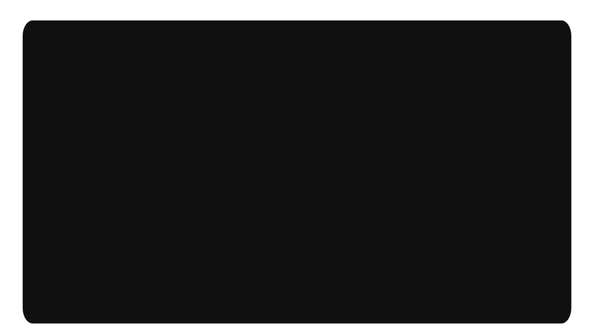

  <a target="_blank" href="https://alysson.dev/" style="user-select: none">
    

      
    

  </a>

 

<!-- aa  -->

  
𝚕𝚊𝚗𝚐𝚞𝚊𝚐𝚎𝚜

    
   
    
  
  

  
𝚜𝚝𝚊𝚝𝚜

    
   

  

  

  

<!-- Social Midiaa -->

  
𝚑𝚎𝚕𝚕𝚘

  
   
  
  <a target="_blank" href="https://alysson.dev/" style="user-select: none">
    

      
    

  </a>

  <a href="mailto:me@4ly.dev">
    
  <a/>
  
  
  
  

 
